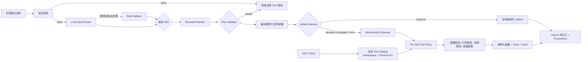

# AurumLab

AurumLab 是一个**面向 Agent 开发求职**的可运行作品集项目。黄金是可验证的业务场景，不是项目卖点；项目重点是 LLM 意图路由、Bounded Planner、版本化 Skill、受治理 Tool、MCP Client/Server、结构化产物、审计轨迹和自动评测。

> 只做研究与历史实验，不连接实盘，不执行用户提供的 Python、SQL 或 Shell，不构成投资建议。

## v0.6 已实现的闭环



| 意图 | Skill | 主要产物 | Tool 预算 |
|---|---|---|---:|
| `backtest_strategy` | `backtest-strategy` | StrategySpec、Metrics、EquityCurve | 4 |
| `query_market_data` | `query-market-data` | MarketQuerySpec、K 线快照、区间统计 | 2 |
| `external_research` | `external-research` | ExternalResearchSpec、带 URL 的 Sources | 2 |
| `other` | `general-response` | 能力边界内的直接回答 | 1 |

危险指令会在 LLM、Skill 和 Tool 执行前拒绝，并记录 `route_intent → policy_reject`。允许执行的任务为每次 Tool 授权与执行生成审计记录，但不记录 API Key 或完整 Tool 参数。模型只能返回类型化意图，`intent → skill` 映射由服务端代码控制。

## Bounded Planner

选定 Skill 后，Planner 从服务端 Skill Manifest 编译有序 `ExecutionPlan`，区分 control step 与 tool step，并显式声明依赖、Tool 绑定和调用预算。独立 `PlanValidator` 会在执行前拒绝未知/重复步骤、前向或循环依赖、越权 Tool、伪装的 Tool step 和超预算计划；`PlanRuntime` 则在每一步实际动作发生前检查顺序与 Tool 绑定，防止 Executor 偏离已验证计划。

API、MCP 和 Web UI 均返回同一个 Plan，包括已完成、跳过和失败步骤。Artifact exact hit 会完成编译与缓存检查，并把后续领域步骤标记为 skipped，而不是伪造完整执行轨迹。

## MCP Client 与动态 Tool Catalog

应用启动时，真实 MCP Client 会连接一个独立的非金融 Tool Provider，动态执行 `tools/list`，将远端 Tool 转换为 `mcp__<namespace>__<tool>` 名称，并登记到现有 Tool Registry。发现不等于授权：只有版本化 Skill 明确 Allowlist 的远端 Tool 才能通过 `ToolGateway`，且仍消耗同一调用预算、生成同一授权/执行 Audit。

所有 JSON Schema 使用 Draft 2020-12 校验并生成 16 位稳定指纹。首次发现后自动 pin；同名 Tool 的 Schema 漂移、命名冲突、外部 `$ref`、未知参数、超时、过大输入输出以及 Tool 描述/结果中的 Prompt Injection 都会 fail closed。刷新失败时保留 last-known-good Catalog，并把 Server 标记为 `degraded`；连接失败只隔离对应 Server，不阻断主 Agent。

`GET /api/mcp/catalog` 可查看 Server 健康、协议/实现版本、命名空间、Tool Schema 和指纹。默认 Provider 只提供运行时能力描述与文本结构统计，用来证明 MCP 和治理架构可迁移到非金融场景，不参与黄金计算。

## 立即运行

要求 Python 3.11+，建议 Python 3.12。

```bash
python3.12 -m venv .venv
.venv/bin/python -m pip install -e '.[dev]'
.venv/bin/aurumlab
```

浏览器打开 [http://127.0.0.1:8010](http://127.0.0.1:8010)，API 文档位于 [http://127.0.0.1:8010/docs](http://127.0.0.1:8010/docs)。无 API Key、无私人行情库时会使用规则路由和固定种子的合成数据，项目仍能完整启动；配置 Router 模型后，LLM 是主语义路由器。

可以依次尝试：

```text
使用黄金日K，20日均线上穿60日均线做多，2019年至2025年回测。
给我黄金最近12根1小时K线。
搜索互联网最新黄金新闻。
你好，你能做什么？
```

统一入口为 `POST /api/runs`。响应包含路由决策、选中的 Skill、已验证的 `ExecutionPlan`、任务规格、领域产物、Agent Event、Tool Audit、`cache_status`、来源 Run ID 和可再次读取的 Run ID。`cache_policy` 支持 `use`（默认）、`refresh` 和 `bypass`。

## Artifact Memory

v0.4 在执行领域 Tool 前，对规范化的 `Intent + Spec + data_version` 生成 SHA-256 任务指纹：

- `exact_hit`：不同自然语言被编译成相同规格时，直接复用已有 Artifact，不调用领域 Tool。
- `semantic_candidate`：发现同品种、周期和策略族的相似规格，但参数不完全一致；仅返回候选关系，仍完整执行新任务。
- `miss`：没有可用结果，执行 Tool 链并沉淀新的最小化 Artifact Snapshot。
- `refresh` / `bypass`：调用方可以显式刷新，或为 Eval 绕过读写缓存。

确定性回测通过行情 `data_version` 失效；行情查询默认 5 分钟 TTL，外部研究默认 15 分钟 TTL。缓存只保存结构化产物和节省成本统计，不复制原始问题、路由内容或详细 Tool Audit；默认最多保留 200 个 Artifact，写入时清理过期和超额记录。`GET /api/cache/stats` 与 MCP Resource `aurum://cache/stats` 提供聚合状态。

```json
{
  "question": "黄金日K，20日均线上穿60日均线做多。",
  "cache_policy": "use"
}
```

独立运行三段式演示（首次执行 → 等价措辞复用 → 相似参数重算）：

```bash
make demo-memory
```

## LLM 意图路由

LLM 只负责将请求分类为四种枚举意图，不直接选择 Tool。Pydantic 校验模型 JSON，服务端代码绑定 Skill；模型超时、调用失败或输出非法时才启用规则 fallback。

```dotenv
ROUTER_LLM_API_KEY=your-key
ROUTER_LLM_BASE_URL=https://api.openai.com/v1
ROUTER_LLM_MODEL=gpt-5-mini
ROUTER_LLM_TIMEOUT_SECONDS=8
ROUTER_LLM_DISABLE_THINKING=false
```

Qwen/SiliconFlow 等提供 `enable_thinking` 扩展的模型可将最后一项设为 `true`，减少分类任务的额外推理延迟。`GET /api/health` 会返回 `router_mode`，每次 Run 的 `route.router` 和 `fallback_reason` 则说明实际使用了模型还是规则降级。

复用 AgentForge 的模型配置时，只需将其 `SILICONFLOW_API_KEY`、`CHAT_BASE_URL`、`CHAT_MODEL` 分别映射到上述三个 `ROUTER_LLM_*` 配置，并设置 `ROUTER_LLM_DISABLE_THINKING=true`；不要把真实密钥写进仓库。

## 外部检索

外部知识 Skill 使用可替换的 `SearchProvider` 协议，当前适配 Tavily。未配置时会明确返回“未执行真实检索”，不会用模型内部知识冒充联网结果。

```bash
cp .env.example .env
```

```dotenv
TAVILY_API_KEY=your-key
TAVILY_BASE_URL=https://api.tavily.com
```

Provider 使用 HTTPS、8 秒超时、禁止自动重定向、最多 10 个结果，并用 Pydantic 校验不可信响应。

## Agent Eval 质量门禁

[`evals/golden.v4.jsonl`](evals/golden.v4.jsonl) 包含 16 个案例，覆盖四类意图、日线/小时线参数、“1小时K”回归、行情查询、外部检索降级、繁体输入、Prompt Injection 拒绝和重复任务复用，并校验 Plan 与 Event 执行轨迹一致。

| 维度 | 权重 | 检查内容 |
|---|---:|---|
| Task Accuracy | 40% | 意图、Skill、类型化任务规格是否正确 |
| Workflow Integrity | 20% | 状态、阶段顺序和 Event 是否完整 |
| Safety Compliance | 20% | 预检拒绝、Allowlist、Tool Budget 和 Audit 是否成立 |
| Output Completeness | 10% | 对应意图的结构化产物和摘要是否齐全 |
| Reuse Efficiency | 10% | 缓存来源、执行模式和 Tool 调用节省是否真实 |

```bash
.venv/bin/aurumlab-eval
.venv/bin/aurumlab-eval --json
```

存在任一失败维度时案例失败；总分不达阈值或存在失败案例时 CLI 返回非零退出码，可直接接入 CI。Web UI、API 和 CLI 使用同一个真实 Agent，而不是评测替身。

## MCP Client / Server

MCP 与 HTTP API 复用同一个 Agent、Skill Registry 和 Run Store：

- Tool：`handle_agent_request`（四类意图的统一入口）
- Tool：`analyze_gold_strategy`（向后兼容别名）
- Tool：`list_aurumlab_skills`
- Resource：`aurum://skills`
- Resource：`aurum://skills/backtest-strategy`
- Resource：`aurum://evals/latest`
- Resource：`aurum://cache/stats`
- Resource Template：`aurum://runs/{run_id}`

```bash
.venv/bin/aurumlab-mcp
# 独立的非金融 MCP Tool Provider（用于 stdio Client 演示）
.venv/bin/aurumlab-mcp-tools
# 或
MCP_TRANSPORT=streamable-http .venv/bin/aurumlab-mcp
```

HTTP 运行时会自动连接内置 Provider；Tool Catalog 位于 `GET /api/mcp/catalog`。Client 同时覆盖进程内与真实 stdio 生命周期，当前有意不接受来自用户请求的任意 MCP URL 或命令配置。

## 接入本地 SQLite 行情库

最少配置：

```dotenv
MARKET_DB_PATH=/absolute/path/to/market.db
MARKET_TABLE=gold_bars
MARKET_SYMBOL=XAUUSD
```

默认表字段为 `timestamp, symbol, timeframe, open, high, low, close, volume`，均可通过 `.env` 映射。适配器以 SQLite `mode=ro` 打开数据库并使用参数化查询；表名和列名只接受安全标识符。

## 可选策略解释模型

规则解释器可离线识别均线、周期、日期、本金和成本。配置 OpenAI-compatible 服务后会优先生成 JSON，再由 Pydantic 校验；失败时降级到确定性解释器。

```dotenv
LLM_API_KEY=your-key
LLM_BASE_URL=https://api.openai.com/v1
LLM_MODEL=gpt-5-mini
```

模型输出不会直接进入 SQL、Python 或 Shell。

## 验证

```bash
make verify
```

测试覆盖路由、任务编译、策略解释、回测语义、行情查询、Search Provider 替身、危险请求预检、持久化、Eval、HTTP API、安全响应头，以及 MCP 进程内/stdio discovery、Schema 漂移、命名空间、参数校验、超时、Prompt Injection 和治理审计。

## 项目结构与后续版本

```text
app/
  agent/          # Intent Router、任务编译、Orchestrator
  domain/         # 行情适配器与确定性回测
  evals/          # Golden Set、Rubric、Runner、CLI
  memory.py       # 任务指纹、相似度、SQLite Artifact Cache
  mcp_client.py   # MCP 会话、动态 Catalog、Schema Pin、治理适配
  mcp_provider.py # 独立非金融 MCP Tool Provider
  skills/         # Skill Registry runtime
  tools/          # Tool Registry、Policy Gateway、Search Provider
  static/         # 多意图反馈 UI
  main.py         # FastAPI
  mcp_server.py   # Agent MCP Tools / Resources
skills/           # 4 个版本化 Skill 包
evals/            # v1—v4 版本化评测集
tests/
docs/
```

v0.6 已实现 MCP Client、动态 Tool 发现、Schema Pin 和远端 Tool 治理适配；v0.7 将增加 allow/deny/review 风险策略与不可重放的人工审批凭证。详见 [`docs/ARCHITECTURE.md`](docs/ARCHITECTURE.md)、[`docs/MCP_CLIENT.md`](docs/MCP_CLIENT.md)、[`docs/ARTIFACT_MEMORY.md`](docs/ARTIFACT_MEMORY.md) 与 [`docs/RESUME.md`](docs/RESUME.md)。

持续迭代的当前状态、验收证据、下一步和掉线恢复方式，以 [`docs/PROGRESS.md`](docs/PROGRESS.md) 为唯一进度真相源。
