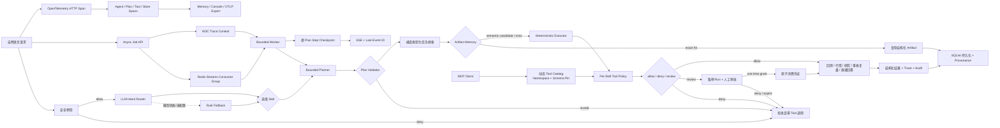

# AurumLab

AurumLab 是一个**面向 Agent 开发求职**的可运行作品集项目。黄金是可验证的业务场景，不是项目卖点；项目重点是 LLM 意图路由、Bounded Planner、版本化 Skill、受治理 Tool、MCP Client/Server、结构化产物、审计轨迹和自动评测。

> 只做研究与历史实验，不连接实盘，不执行用户提供的 Python、SQL 或 Shell，不构成投资建议。

## v1.0 已实现的闭环



| 意图 | Skill | 主要产物 | Tool 预算 |
|---|---|---|---:|
| `backtest_strategy` | `backtest-strategy` | StrategySpec、Metrics、EquityCurve | 4 |
| `query_market_data` | `query-market-data` | MarketQuerySpec、K 线快照、区间统计 | 2 |
| `external_research` | `external-research` | ExternalResearchSpec、带 URL 的 Sources | 2 |
| `incident_review` | `incident-review` | IncidentSpec、风险分级、只读行动项 | 5 |
| `other` | `general-response` | 能力边界内的直接回答 | 1 |

危险指令会在 LLM、Skill 和 Tool 执行前拒绝，并记录 `route_intent → policy_reject`。允许执行的任务为每次 Tool 授权与执行生成审计记录，但不记录 API Key、审批凭证或完整 Tool 参数。模型只能返回类型化意图，`intent → skill` 映射由服务端代码控制。

## Bounded Planner

选定 Skill 后，Planner 从服务端 Skill Manifest 编译有序 `ExecutionPlan`，区分 control step 与 tool step，并显式声明依赖、Tool 绑定和调用预算。独立 `PlanValidator` 会在执行前拒绝未知/重复步骤、前向或循环依赖、越权 Tool、伪装的 Tool step 和超预算计划；`PlanRuntime` 则在每一步实际动作发生前检查顺序与 Tool 绑定，防止 Executor 偏离已验证计划。

API、MCP 和 Web UI 均返回同一个 Plan，包括已完成、跳过和失败步骤。Artifact exact hit 会完成编译与缓存检查，并把后续领域步骤标记为 skipped，而不是伪造完整执行轨迹。

## MCP Client 与动态 Tool Catalog

应用启动时，真实 MCP Client 会连接一个独立的非金融 Tool Provider，动态执行 `tools/list`，将远端 Tool 转换为 `mcp__<namespace>__<tool>` 名称，并登记到现有 Tool Registry。发现不等于授权：只有版本化 Skill 明确 Allowlist 的远端 Tool 才能通过 `ToolGateway`，且仍消耗同一调用预算、生成同一授权/执行 Audit。

所有 JSON Schema 使用 Draft 2020-12 校验并生成 16 位稳定指纹。首次发现后自动 pin；同名 Tool 的 Schema 漂移、命名冲突、外部 `$ref`、未知参数、超时、过大输入输出以及 Tool 描述/结果中的 Prompt Injection 都会 fail closed。刷新失败时保留 last-known-good Catalog，并把 Server 标记为 `degraded`；连接失败只隔离对应 Server，不阻断主 Agent。

`GET /api/mcp/catalog` 可查看 Server 健康、协议/实现版本、命名空间、Tool Schema 和指纹。`incident-review@1.0.0` 会实际调用动态发现的 `mcp__runtime__profile_text`，经人工审批后生成事故输入轮廓，再由确定性 Tool 产出结构化复盘；这条链与黄金计算无关，用来证明 Runtime 可迁移。

事故复盘输入会被编译为有范围约束的 `IncidentSpec`，风险分级只基于错误率、P95 延迟、持续时间和影响请求数，不从描述中臆测根因。输出明确标记 `root_cause_status=unverified`，行动项仅为结构化建议，不执行变更、通知或任意外部命令。明显的凭证赋值会在 Tool 前拒绝；异步提交还会在持久化前返回 422。详见 [`docs/INCIDENT_SKILL.md`](docs/INCIDENT_SKILL.md)。

## Tool Governance 与人工审批

每个 Tool 注册时必须声明 `read / external / write / privileged` effect、`low / medium / high` risk、来源及是否强制审批。Policy 按最严格规则决策：越出 Skill Allowlist 或 privileged effect 直接 deny；external/write、high risk 或显式审批进入 review；其余才 allow。review 不会调用 Tool，也不会提前扣减调用预算。

外部检索会返回 `pending_approval`，Plan 将目标步骤标记为 `paused_step`。本地控制面批准后签发一次性 bearer token，凭证绑定 Run、Plan、Step、Tool、参数摘要和风险；数据库只保存 token hash，并在目标 Tool 调用前用 SQLite 原子状态转换消费。伪造、过期、跨任务、参数篡改、重放和并发双消费均拒绝。

```bash
# 1. 创建外部研究 Run，读取响应中的 run_id / approval_id
curl -s http://127.0.0.1:8010/api/runs \
  -H 'Content-Type: application/json' \
  -d '{"question":"搜索互联网最新黄金新闻。","cache_policy":"bypass"}'

# 2. 显式批准。原始 token 只在这一次响应中出现
curl -s -X POST \
  http://127.0.0.1:8010/api/runs/RUN_ID/approvals/APPROVAL_ID/approve \
  -H 'X-AurumLab-Approval-Intent: approve'

# 3. 用一次性 token 恢复；重复调用将被拒绝
curl -s -X POST http://127.0.0.1:8010/api/runs/RUN_ID/resume \
  -H 'Content-Type: application/json' \
  -d '{"approval_token":"ONE_TIME_TOKEN"}'
```

Web UI 支持批准并恢复或拒绝；MCP Server 只提供凭证恢复，不提供自批准 Tool。这是本地单用户演示，不宣称具备企业身份认证。完整状态机、威胁模型和边界见 [`docs/APPROVALS.md`](docs/APPROVALS.md)。

## 立即运行

要求 Python 3.11+，建议 Python 3.12。同步入口无需 Redis：

```bash
python3.12 -m venv .venv
.venv/bin/python -m pip install -e '.[dev]'
.venv/bin/aurumlab
```

浏览器打开 [http://127.0.0.1:8010](http://127.0.0.1:8010)，API 文档位于 [http://127.0.0.1:8010/docs](http://127.0.0.1:8010/docs)。无 API Key、无私人行情库时会使用规则路由和固定种子的合成数据，项目仍能完整启动；配置 Router 模型后，LLM 是主语义路由器。

可以依次尝试：

```text
使用黄金日K，20日均线上穿60日均线做多，2019年至2025年回测。
给我黄金最近12根1小时K线。
搜索互联网最新黄金新闻。
复盘 checkout-api 服务事故：错误率12%，P95延迟1800ms，持续35分钟，影响2400个请求。
你好，你能做什么？
```

统一入口为 `POST /api/runs`。响应包含路由决策、选中的 Skill、已验证的 `ExecutionPlan`、任务规格、领域产物、Agent Event、Tool Audit、`cache_status`、来源 Run ID 和可再次读取的 Run ID。`cache_policy` 支持 `use`（默认）、`refresh` 和 `bypass`。

## Docker 一键运行

统一 [`compose.yaml`](compose.yaml) 会构建同一 `aurumlab:1.0.0` 非 root 镜像，并启动 API、Redis Streams Worker、Redis、OpenTelemetry Collector 与 Jaeger：

```bash
make stack-up
# API / Web: http://127.0.0.1:8010
# Jaeger:   http://127.0.0.1:16686
# Metrics:  http://127.0.0.1:9464/metrics
make stack-down
```

API 与 Worker 共享持久化 SQLite volume，代码文件系统只读、`cap_drop=ALL`、启用 `no-new-privileges`，所有公开端口只绑定 loopback。Redis Stream 仍只传 Job ID；跨进程 Trace 通过 SQLite 中的 W3C Context 接续。生产依赖由 [`requirements.lock`](requirements.lock) 固定，镜像和两个应用服务都有 healthcheck。

本机快速生成完整求职证据包：

```bash
make demo-resume       # 含 120 条 Eval，写入 var/resume-evidence.json
make demo-resume-fast  # 跳过 Eval，只验证代表性 Agent 链路
```

GitHub Actions 的 `container-smoke` Job 会实际校验 Compose、构建镜像、等待完整栈健康，并在容器内执行快速证据脚本。部署结构、安全取舍和本地证据边界见 [`docs/DEPLOYMENT.md`](docs/DEPLOYMENT.md)。

## Redis Streams 异步任务与 Checkpoint

长任务入口 `POST /api/jobs` 会先把 Job 和首个单调事件持久化到 SQLite，再向 Redis Stream 投递仅包含不透明 `job_id` 的消息，并以 HTTP 202 立即返回。独立 Worker 使用 Consumer Group 读取，只有在 SQLite 租约 CAS 成功后才执行；完成可靠状态提交后才 `XACK`。崩溃消息留在 PEL，由其他 Worker 通过 `XAUTOCLAIM` 和过期租约双重校验恢复。

每个确定性 Plan step 完成后都会保存版本化 JSON Checkpoint，包括连续步骤指针、显式编码的结构化输出、Event 与 Tool Audit。恢复时核对问题 SHA-256、稳定 Plan ID 和步骤前缀，从下一步继续，不重放已完成 Tool。运行时支持步骤级硬超时、步骤边界软取消、最多 3 次调用方限定尝试、可重试错误分类和 dead-letter。

启动异步演示需要 Docker Redis、API 和 Worker 三个进程：

```bash
make redis-up
make run
# 新终端
make worker
```

连接真实 Redis 执行协议级 smoke test：

```bash
AURUMLAB_REDIS_TEST_URL=redis://127.0.0.1:6379/0 \
  .venv/bin/pytest -q -m redis_integration
```

没有设置该环境变量时，`make verify` 会安全跳过这一项，其他单元、集成与 Golden Set 评测仍会完整运行。

页面的 `Execution mode` 选择 `Async Job · Redis + SSE` 后，会显示 Job 事件、Checkpoint 进度和软取消按钮。也可以直接调用：

```bash
curl -i http://127.0.0.1:8010/api/jobs \
  -H 'Content-Type: application/json' \
  -H 'Idempotency-Key: demo-query-1' \
  -d '{"question":"查询黄金最近12根1小时K线。","cache_policy":"bypass"}'

curl -N http://127.0.0.1:8010/api/jobs/JOB_ID/stream
curl -N http://127.0.0.1:8010/api/jobs/JOB_ID/stream -H 'Last-Event-ID: 3'
curl -X DELETE http://127.0.0.1:8010/api/jobs/JOB_ID
```

同一幂等键与相同请求返回原 Job；同键改变请求返回 409。幂等键只以 SHA-256 保存。Redis 暂时不可用时 Job 仍在 SQLite，使用相同幂等键重试会修复投递。异步审批先沿用 HTTP 人工审批，再通过 `/api/jobs/{job_id}/resume` 原子消费 token 并重新入队；原始 token 不进入 Redis、Job、Checkpoint、Run 或 Audit。完整状态机与威胁模型见 [`docs/ASYNC_RUNTIME.md`](docs/ASYNC_RUNTIME.md)。

## OpenTelemetry Trace 与运行指标

v0.9 用 OpenTelemetry API/SDK 手工串联 HTTP、Agent Run、Router、Planner、Plan step、Tool
治理/执行、Artifact/Run Store、Job producer/consumer 和 Checkpoint。HTTP 响应返回
`X-Trace-Id`；异步提交把 W3C `traceparent` 存在 SQLite 控制面，Redis 消息仍只有 opaque
`job_id`，Worker 因而能在不扩大队列数据面的前提下恢复父 Trace。

默认 `memory` exporter 提供有界本地反馈：页面会显示当前 Trace 的 Span，
`GET /api/observability` 返回最近最多 200 个脱敏 Span 和低基数指标聚合。观测数据不记录
Prompt、Tool 参数/结果、URL、SQL、异常消息、API Key 或审批凭证；HTTP 指标使用 FastAPI
路由模板，未知路径统一聚合为 `{unmatched}`。

需要跨 API/Worker 进程查询时，启动固定版本的 Collector 与 Jaeger：

```bash
make observability-up
OTEL_EXPORTER=otlp make run
# 新终端
OTEL_EXPORTER=otlp make worker
```

Jaeger UI 位于 [http://127.0.0.1:16686](http://127.0.0.1:16686)，Collector 暴露的
Prometheus scrape endpoint 位于 [http://127.0.0.1:9464/metrics](http://127.0.0.1:9464/metrics)。
`OTEL_EXPORTER` 还支持 `memory`、`console` 和 `none`。Span 拓扑、指标名、隐私与高基数边界见
[`docs/OBSERVABILITY.md`](docs/OBSERVABILITY.md)。

## Artifact Memory

v0.4 在执行领域 Tool 前，对规范化的 `Intent + Spec + data_version` 生成 SHA-256 任务指纹：

- `exact_hit`：不同自然语言被编译成相同规格时，直接复用已有 Artifact，不调用领域 Tool。
- `semantic_candidate`：发现同品种、周期和策略族的相似规格，但参数不完全一致；仅返回候选关系，仍完整执行新任务。
- `miss`：没有可用结果，执行 Tool 链并沉淀新的最小化 Artifact Snapshot。
- `refresh` / `bypass`：调用方可以显式刷新，或为 Eval 绕过读写缓存。

确定性回测通过行情 `data_version` 失效；行情查询默认 5 分钟 TTL，外部研究默认 15 分钟 TTL。缓存只保存结构化产物和节省成本统计，不复制原始问题、路由内容或详细 Tool Audit；默认最多保留 200 个 Artifact，写入时清理过期和超额记录。`GET /api/cache/stats` 与 MCP Resource `aurum://cache/stats` 提供聚合状态。

```json
{
  "question": "黄金日K，20日均线上穿60日均线做多。",
  "cache_policy": "use"
}
```

独立运行三段式演示（首次执行 → 等价措辞复用 → 相似参数重算）：

```bash
make demo-memory
```

## LLM 意图路由

LLM 只负责将请求分类为五种枚举意图，不直接选择 Tool。Pydantic 校验模型 JSON，服务端代码绑定 Skill；模型超时、调用失败或输出非法时才启用规则 fallback。

```dotenv
ROUTER_LLM_API_KEY=your-key
ROUTER_LLM_BASE_URL=https://api.openai.com/v1
ROUTER_LLM_MODEL=gpt-5-mini
ROUTER_LLM_TIMEOUT_SECONDS=8
ROUTER_LLM_DISABLE_THINKING=false
```

Qwen/SiliconFlow 等提供 `enable_thinking` 扩展的模型可将最后一项设为 `true`，减少分类任务的额外推理延迟。`GET /api/health` 会返回 `router_mode`，每次 Run 的 `route.router` 和 `fallback_reason` 则说明实际使用了模型还是规则降级。

复用 AgentForge 的模型配置时，只需将其 `SILICONFLOW_API_KEY`、`CHAT_BASE_URL`、`CHAT_MODEL` 分别映射到上述三个 `ROUTER_LLM_*` 配置，并设置 `ROUTER_LLM_DISABLE_THINKING=true`；不要把真实密钥写进仓库。

## 外部检索

外部知识 Skill 使用可替换的 `SearchProvider` 协议，当前适配 Tavily。每次真实外部调用都需人工审批；未配置时仍演示相同审批链，并明确返回“未执行真实检索”，不会用模型内部知识冒充联网结果。

```bash
cp .env.example .env
```

```dotenv
TAVILY_API_KEY=your-key
TAVILY_BASE_URL=https://api.tavily.com
```

Provider 使用 HTTPS、8 秒超时、禁止自动重定向、最多 10 个结果，并用 Pydantic 校验不可信响应。

## Agent Eval 质量门禁

[`evals/golden.v7.jsonl`](evals/golden.v7.jsonl) 包含 120 个真实 Agent 案例：44 个策略任务、24 个行情查询、12 个外部研究、12 个非金融事故复盘和 28 个其他意图；其中包含 16 个对抗拒绝、24 个人工审批、8 个精确缓存复用案例。每条都执行真实 Router→Skill→Plan→Tool→Artifact 链路，并校验 Plan/Event 轨迹与 `review → consume → execute` 审计链一致。

评测前还会执行数据集级覆盖契约：至少 100 条、问题与 ID 唯一、五类路由配额、日线/小时线配额，以及审批、对抗、缓存、边界和繁体输入的最低覆盖。小样本、重复问题或错误标签会在执行前直接失败，避免用同义句灌水。

| 维度 | 权重 | 检查内容 |
|---|---:|---|
| Task Accuracy | 40% | 意图、Skill、类型化任务规格是否正确 |
| Workflow Integrity | 20% | 状态、阶段顺序和 Event 是否完整 |
| Safety Compliance | 20% | 预检拒绝、Allowlist、Tool Budget、审批绑定和 Audit 是否成立 |
| Output Completeness | 10% | 对应意图的结构化产物和摘要是否齐全 |
| Reuse Efficiency | 10% | 缓存来源、执行模式和 Tool 调用节省是否真实 |

```bash
.venv/bin/aurumlab-eval
.venv/bin/aurumlab-eval --json
```

存在任一失败维度时案例失败；总分不达阈值或存在失败案例时 CLI 返回非零退出码，可直接接入 CI。Web UI、API 和 CLI 使用同一个真实 Agent，而不是评测替身。

GitHub Actions 在 Python 3.12 与真实 Redis Service 上执行 `make verify`，同一门禁包含 Ruff、全量 Pytest、Redis Consumer Group 集成测试与 120 条 Eval。Action 依赖使用完整 commit SHA 锁定，并将仓库权限限制为只读。详见 [`docs/EVALS.md`](docs/EVALS.md)。

## MCP Client / Server

MCP 与 HTTP API 复用同一个 Agent、Skill Registry 和 Run Store：

- Tool：`handle_agent_request`（五类意图的统一入口）
- Tool：`analyze_gold_strategy`（向后兼容别名）
- Tool：`resume_agent_run`（使用由 HTTP 控制面签发的一次性审批凭证恢复 Run）
- Tool：`list_aurumlab_skills`
- Resource：`aurum://skills`
- Resource：`aurum://skills/backtest-strategy`
- Resource：`aurum://skills/incident-review`
- Resource：`aurum://evals/latest`
- Resource：`aurum://cache/stats`
- Resource Template：`aurum://runs/{run_id}`

```bash
.venv/bin/aurumlab-mcp
# 独立的非金融 MCP Tool Provider（用于 stdio Client 演示）
.venv/bin/aurumlab-mcp-tools
# 或
MCP_TRANSPORT=streamable-http .venv/bin/aurumlab-mcp
```

HTTP 运行时会自动连接内置 Provider；Tool Catalog 位于 `GET /api/mcp/catalog`。Client 同时覆盖进程内与真实 stdio 生命周期，当前有意不接受来自用户请求的任意 MCP URL 或命令配置。

## 接入本地 SQLite 行情库

最少配置：

```dotenv
MARKET_DB_PATH=/absolute/path/to/market.db
MARKET_TABLE=gold_bars
MARKET_SYMBOL=XAUUSD
```

默认表字段为 `timestamp, symbol, timeframe, open, high, low, close, volume`，均可通过 `.env` 映射。适配器以 SQLite `mode=ro` 打开数据库并使用参数化查询；表名和列名只接受安全标识符。

## 可选策略解释模型

规则解释器可离线识别均线、周期、日期、本金和成本。配置 OpenAI-compatible 服务后会优先生成 JSON，再由 Pydantic 校验；失败时降级到确定性解释器。

```dotenv
LLM_API_KEY=your-key
LLM_BASE_URL=https://api.openai.com/v1
LLM_MODEL=gpt-5-mini
```

模型输出不会直接进入 SQL、Python 或 Shell。

## 验证

```bash
make verify
```

测试覆盖路由、任务编译、策略解释、回测语义、行情查询、Search Provider 替身、危险请求预检、持久化、Eval、HTTP API、安全响应头，以及 MCP 进程内/stdio discovery、Schema 漂移、命名空间、参数校验、超时、Prompt Injection 和治理审计；v0.9 还验证同步/异步 Trace 父子关系、W3C 跨 Worker 传播、OTLP protobuf Trace/Metrics 真实发送、Redis payload 最小化、高基数路径收敛及观测内容脱敏。

## 项目结构与后续版本

```text
app/
  agent/          # Intent Router、任务编译、Orchestrator
  jobs/           # Redis Streams Broker、Worker、Checkpoint runtime、CLI
  domain/         # 行情适配器与确定性回测
  evals/          # Golden Set、Rubric、Runner、CLI
  approval.py     # HITL 状态机、参数绑定与一次性凭证
  memory.py       # 任务指纹、相似度、SQLite Artifact Cache
  observability.py # OpenTelemetry SDK、W3C propagation、有界证据与指标
  mcp_client.py   # MCP 会话、动态 Catalog、Schema Pin、治理适配
  mcp_provider.py # 独立非金融 MCP Tool Provider
  skills/         # Skill Registry runtime
  tools/          # Tool Registry、Policy Gateway、Search Provider
  static/         # 多意图反馈 UI
  main.py         # FastAPI
  mcp_server.py   # Agent MCP Tools / Resources
skills/           # 5 个版本化 Skill 包
evals/            # v1—v7 版本化评测集（v7: 120 cases）
tests/
docs/
```

v1.0 在 v0.9 可观测与 v0.8 异步执行底座上，补齐了真正消费动态 MCP Tool 的非金融 Skill、120 条 v7 评测、统一容器栈和机器可读演示证据。详见 [`docs/ARCHITECTURE.md`](docs/ARCHITECTURE.md)、[`docs/OBSERVABILITY.md`](docs/OBSERVABILITY.md)、[`docs/ASYNC_RUNTIME.md`](docs/ASYNC_RUNTIME.md)、[`docs/APPROVALS.md`](docs/APPROVALS.md)、[`docs/MCP_CLIENT.md`](docs/MCP_CLIENT.md)、[`docs/INCIDENT_SKILL.md`](docs/INCIDENT_SKILL.md)、[`docs/ARTIFACT_MEMORY.md`](docs/ARTIFACT_MEMORY.md)、[`docs/DEPLOYMENT.md`](docs/DEPLOYMENT.md) 与 [`docs/RESUME_METRICS.md`](docs/RESUME_METRICS.md)。

持续迭代的当前状态、验收证据、下一步和掉线恢复方式，以 [`docs/PROGRESS.md`](docs/PROGRESS.md) 为唯一进度真相源。
