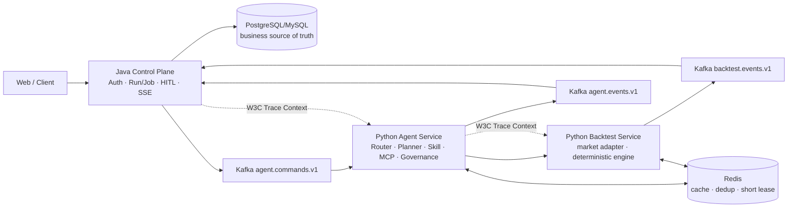

# GoldAnalyze Java / Python 微服务改造方案

## 1. 改造结论

现有 AurumLab 不是需要推倒重写的原型，而是已经验证过的 Python Agent Runtime。改造采用“先加端口、再换适配器”的方式：保留 Agent Orchestrator、Planner、Skill/MCP、Tool Governance、Checkpoint、回测领域模型与 OpenTelemetry；Java Spring Boot 新增为唯一公开控制平面和业务持久层；Python 拆成 Agent Service 与 Backtest Engine 两个内部服务。

黄金仍是可验证的计算场景。项目在简历中的主语依然是：跨语言 Agent 执行系统如何做职责分离、受控调用、异步恢复、契约治理和端到端观测，而不是金融收益。



## 2. 当前代码评估与归属

| 当前模块 | 结论 | 微服务归属 |
|---|---|---|
| `app/agent/orchestrator.py`、Router、Planner、Checkpoint | 保留；把 SQLite/Redis Streams 适配器换成外部 Port | Agent Service |
| `app/skills`、`skills/*`、Tool Registry、MCP Client | 原样复用；Tool Governance 仍在实际调用前执行 | Agent Service |
| `app/domain/backtest.py` | 保留为无网络、无数据库写入的确定性 Domain | Backtest Service |
| `app/domain/market_data.py` | 保留只读 Adapter；后续增加连接池和按时间范围下推查询 | Backtest Service |
| `app/observability.py` | 复用，服务名拆分并传播 W3C Context | 两个 Python 服务 |
| `app/main.py` 的公开 API、SSE、Run/Job 查询 | 作为 standalone 演示兼容入口保留，不再是微服务生产入口 | Java Control Plane 替代 |
| `RunRepository`、`JobRepository`、`ApprovalRepository` | 不跨服务共享 SQLite，不让 Python 直写 Java 库 | Java 持久化；Python 只返回事件/Checkpoint |
| Redis Streams Worker | 保留测试过的执行/恢复思想；跨语言传输改为 Kafka Adapter | Agent/Backtest Worker |
| Artifact Memory | 指纹算法保留；Redis 作为可丢失缓存，最终 Artifact 由 Java 落库 | Java + Agent Service |

关键边界：Java 不导入 Python 内部 ORM，Python 不连接 Java 业务数据库；二者只共享版本化契约。Agent Checkpoint 由 Python 定义 Schema，由 Java 作为带版本的 JSON Artifact 持久化，恢复命令再原样传回 Python。

## 3. 技术选型

### 3.1 REST + JSON，而不是先上 gRPC

Java 调 Python Backtest 的第一版采用内部 REST：Pydantic/FastAPI 与 Spring/Jackson 都能直接使用 OpenAPI/JSON Schema，调试成本低，也便于面试现场展示。当前日线/小时线回测结果只有几百个净值采样点，不存在必须使用 gRPC 的吞吐证据。未来只有在 profiling 证明序列化或连接开销成为瓶颈后再引入 gRPC。

### 3.2 Kafka 负责跨服务长任务

选择 Kafka，而不是继续让 Java 直接消费现有 Redis Streams：

- Java/Spring Kafka 与 Python Consumer 都成熟，适合命令/事件解耦和重放。
- 以 `job_id` 为 message key，可保证同一任务内的有序事件。
- Consumer Group、offset、保留策略与 DLQ 更容易形成招聘场景中可解释的可靠性方案。
- 不追求“Exactly Once”口号；采用 at-least-once + 业务幂等 + Java 条件状态更新。

固定 Topic：

| Topic | Producer | Consumer | Key |
|---|---|---|---|
| `goldanalyze.agent.commands.v1` | Java | Agent Service | `job_id` |
| `goldanalyze.agent.events.v1` | Agent Service | Java | `job_id` |
| `goldanalyze.backtest.commands.v1` | Java/Agent | Backtest Worker | `job_id` |
| `goldanalyze.backtest.events.v1` | Backtest Worker | Java/Agent | `job_id` |

每个命令 Topic 配独立 `.dlq`；重试只处理超时、临时网络和依赖不可用，Schema 错误、数据版本冲突、越权或 Prompt Injection 不重试。Topic/回信目标只能来自部署配置，消息体不允许 `reply_topic`、任意 URL 或脚本字段。

### 3.3 Redis 只做可重建状态

Redis 用于：

- `SET NX PX` 幂等/短租约，防止同一 Consumer Group 异常重平衡造成并发计算。
- Artifact exact-hit 缓存，Key 包含 Intent、类型化 Spec、数据/Schema/Skill 版本。
- 可选的短期结果缓存和限流计数。

Redis 不保存唯一 Job 状态，不承担审计真相，也不保存审批明文凭证。Redis 丢失最多导致重算；Java 数据库中的 Job、审批、事件和 Artifact 仍可恢复。

## 4. 状态所有权与执行时序

1. Java 校验用户权限并在本地事务中创建 Job/Run 和 Outbox 记录。
2. Outbox Relay 发布 `agent.run.requested.v1`；HTTP 请求无需等待 Python。
3. Agent Consumer 校验 JSON Schema、消息大小、版本、deadline 和服务来源，再以 `job_id` 认领短租约。
4. Agent 执行 Router → Skill → Bounded Plan → Governance。需要回测时调用内部 Backtest REST；需要人工审批时发布 `agent.run.approval-required.v1`，同时返回版本化 Checkpoint。
5. Java 条件更新状态并向前端提供 SSE；人工决定持久化后发布与 Run/Plan/Step/Tool/参数摘要绑定的恢复命令。
6. Python 验证绑定，恢复 Checkpoint 的下一步，不重放已完成 Tool；最终发布 completed/rejected/failed 事件。
7. Java Inbox 表按 `message_id` 去重并在同一事务中更新状态、保存 Artifact 和事件，再提交 Kafka offset。

不做跨库事务，也不让 Python 回调用户提供的 URL。Java 使用 Transactional Outbox/Inbox 消除“数据库已提交但消息未发送”和重复消费问题。

## 5. HTTP 契约

当前已实现：

| Method | Path | 用途 | 鉴权 |
|---|---|---|---|
| `GET` | `/health/live` | 进程存活 | 无 |
| `GET` | `/health/ready` | 行情 Adapter 可用 | 无 |
| `POST` | `/internal/v1/backtests/execute` | 有界确定性回测 | Service Bearer Token；线上叠加 TLS/mTLS |

请求必须包含 `request_id`、`job_id`、`run_id`、至少 16 字符的 `idempotency_key`、带起止日期的 `StrategySpec`，并限制 bars、trades 和 deadline。可选 `expected_data_version` 用于阻止控制平面请求的数据版本与计算节点不一致。

成功响应包含：Engine/Data 版本、Data Profile、指标、交易、下采样净值曲线、warning 和对确定性字段计算的 SHA-256 `result_digest`。错误统一使用 `application/problem+json`，只暴露稳定 `code`，不返回堆栈、数据库路径、Token 或原始异常。

权威文件：[`contracts/backtest-service.openapi.json`](contracts/backtest-service.openapi.json)。

## 6. Kafka / JSON Schema 契约

消息 Envelope 包含：UUID `message_id`、correlation/causation ID、固定 producer、UTC 时间、W3C `traceparent` 和 1—3 次 attempt。所有 Pydantic 合约均 `extra=forbid`，未知字段直接进入不可重试 DLQ；Schema 版本与事件类型使用常量，避免静默解析错误版本。

权威文件：[`contracts/asyncapi.v1.json`](contracts/asyncapi.v1.json)、[`contracts/manifest.json`](contracts/manifest.json) 和 [`contracts/schemas`](contracts/schemas)。CI 必须重新生成并执行 `git diff --exit-code docs/contracts`。同一 v1 只允许增加可选字段；删除/改名、缩窄枚举或改变语义必须新建 v2 Topic。

### Java DTO 参考

```java
public record BacktestExecuteRequest(
    String schemaVersion,
    String requestId,
    String jobId,
    String runId,
    String idempotencyKey,
    StrategySpec strategy,
    String expectedDataVersion,
    int maxBars,
    int maxTrades,
    Instant requestedAt,
    Instant deadlineAt
) {}
```

Java WebClient 应设置连接/响应超时、`Authorization` 与 `traceparent`，只允许配置中心给出的 Backtest Service Base URL；不能接收用户传入的 URL。HTTP 409 `DATA_VERSION_CONFLICT`、422 输入/负载错误不重试；408 和 5xx 最多有界重试，仍使用同一个 idempotency key。

## 7. 安全与治理

STRIDE 重点边界：Java→Kafka、Kafka→Python、Agent→Backtest、模型输出→Tool、行情数据库→计算引擎。

- Spoofing：本地先用至少 32 字符 Service Token；生产用 TLS/mTLS、Kafka SASL/ACL 和独立 Service Account。
- Tampering：Schema 校验、`result_digest`、data version；生产可再对消息做 JWS，不能把 HMAC Secret 放进消息。
- Repudiation：Java 保存不可变业务事件；Python 发布 Tool Audit/Checkpoint，不直接修改控制面记录。
- Information Disclosure：不把审批 Token、API Key、完整 Prompt 或数据库绝对路径写入 Kafka/Trace/错误。
- Denial of Service：限制 question、消息、日期跨度、bars、trades、deadline、Tool Budget、重试和 Consumer 并发。
- Elevation of Privilege：LLM 仍不能创建 Tool 名称、改变 Skill allowlist 或扩大预算；MCP discovery 不等于 authorization。

当前 Service Token 只适合本地/受控网络。上线前必须启用 TLS/mTLS 或网关认证；Python 在绑定非 loopback 且没有 Token 时会 fail closed。

## 8. 迁移计划与验收

### v1.1a：契约与 Backtest HTTP（当前小版本）

- 新建严格 Pydantic 契约、OpenAPI/AsyncAPI/JSON Schema 与 hash manifest。
- 抽取 Backtest Application/API，支持只读数据、data-version guard、工作量限制、Service Auth、Problem Details 和 Trace。
- 旧 AurumLab API 不变，保证迁移期间可回归。

### v1.1b：Agent Service Port 化

- 把 Run/Approval/Artifact/Checkpoint 持久化抽象为 Port。
- 新增无公开 UI 的 Agent internal API；结果投影不包含原始问题和审批 Token。
- Agent 通过类型化 Backtest Client 调用独立服务，保留 Governance Audit。

### v1.2：Kafka Worker 与 Redis 幂等

- 实现 Kafka Command Consumer/Event Producer、固定 Topic、Consumer Group、DLQ 和有界 retry。
- 实现 Redis payload-hash 幂等记录与租约；同 key 不同 payload 拒绝，重复完成命令重放相同结果事件。
- Java 用 Outbox/Inbox 落地状态；两边做 Testcontainers/Redpanda 契约联调。

### v1.3：部署与求职证据

- 分离 Agent/Backtest Dockerfile、Compose，加入 Kafka/Redis/Collector/Jaeger。
- CI 增加契约漂移、镜像、健康检查、Kafka 断连/重复投递/重平衡/恢复测试。
- 端到端 Trace 覆盖 Java HTTP → Outbox → Kafka → Agent → Backtest → Event → Java Inbox。
- 更新一键演示、指标快照、架构文档和简历表述。

## 9. CI/CD 与可观测性

Python CI 顺序：Ruff → 单元/契约测试 → 120 条 Agent Eval → 契约重生成无 Diff → 依赖审计 → 构建两个镜像 → 容器健康 → Kafka/Redis 集成。Java CI 可独立运行生成 DTO 的 Schema compatibility 测试；联合流水线用同一个 contract manifest SHA。

Trace 使用 W3C Context：HTTP 放标准 header，Kafka 放受控 metadata/header；禁止 baggage。Span 至少包括 `control-plane.request`、`kafka.produce/consume`、`agent.run`、`plan.step`、`tool.call`、`backtest.execute`、`inbox.persist`。Metric 只用低基数维度：service、operation、status、intent、skill、retry reason；不能把 user/job/run ID 放进指标 Label。

建议 SLI：命令排队延迟、Agent/Backtest 执行耗时、成功率、重试/DLQ 数、幂等命中、审批等待时长、Checkpoint 恢复次数、Artifact exact hit。招聘演示以可复现本地证据为准，不虚构线上 QPS、用户量或收益率。

## 10. 工期估算

只计算 Python 侧：

| 工作 | 集中开发时间 |
|---|---:|
| v1.1a 契约 + Backtest HTTP | 1 天 |
| v1.1b Agent Port/Client/API | 1.5—2 天 |
| v1.2 Kafka + Redis 幂等/恢复 | 1.5—2 天 |
| v1.3 容器、CI、OTel、文档与演示 | 1—2 天 |
| 合计 | 5—7 天 |

与 Java 联调再预留 1—2 天；业余时间按 1—2 周安排。若本地黄金数据库 Schema 与当前配置不一致，额外预留半天完成字段映射与数据质量验收。

## 11. 风险登记

| 风险 | 影响 | 应对 |
|---|---|---|
| Java/Python 各自复制 DTO 后漂移 | 线上反序列化失败 | Schema 单一来源、manifest hash、CI regeneration |
| Kafka 重复/乱序 | 重复计算或状态倒退 | job key、message ID、payload hash、Java 条件状态机 |
| 把 Redis 当数据库 | 缓存清理导致任务丢失 | Java DB 为真相源，Redis 丢失只触发重算 |
| 分布式 HITL 绑定被削弱 | 越权恢复 Tool | 审批绑定 Run/Plan/Step/Tool/args digest，单次消费 |
| 回测请求无限制 | CPU/内存耗尽 | 日期、bars、trades、deadline 和并发上限 |
| Trace 泄露 Prompt/Token | 数据泄露 | Attribute allowlist、无 baggage、错误脱敏 |
| 微服务过度设计 | 项目复杂但无业务价值 | 两个 Python 服务 + 一个 Java 控制面为上限，暂不上 K8s/服务网格 |

## 12. 本地运行当前 Backtest Service

```bash
# 重命名仓库后先重装入口脚本
.venv/bin/python -m pip install -e '.[dev]'

# loopback 开发模式可不配置 Token
make backtest-service

# 生成/核对供 Java 使用的契约
make contracts
make contracts-check
```

默认地址为 `http://127.0.0.1:8020`。绑定 `0.0.0.0` 前必须配置至少 32 字符的 `INTERNAL_SERVICE_TOKEN`；生产环境同时配置 TLS/mTLS 和网络策略。
